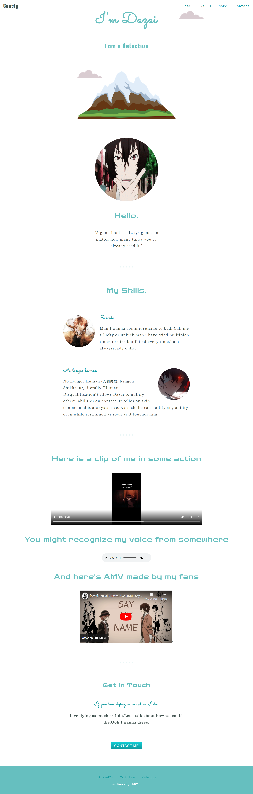
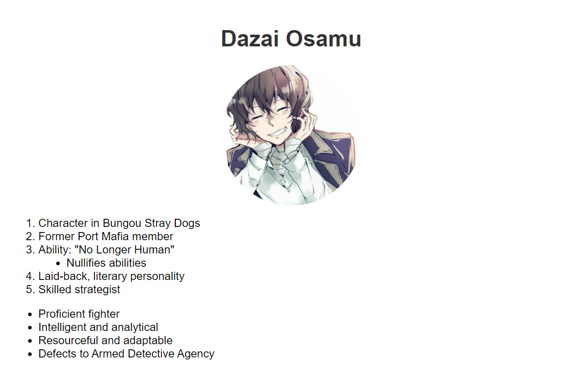

1. Lab 1: HTML Elements.
* Make a webpage with the following html elements:
   * Nested order and unorder list
   * semantics tags for the layout
   * text formatting tags
   * image, video and audio
   * iframe

> Deadline: 23 December, 8 am  
 

